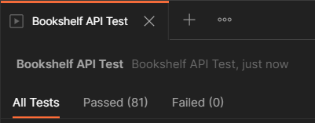

# Bookshelf-API

## Panduan Memulai

Clone repo ini kemudian jalankan command-command berikut :

- Untuk memasang proyek
  
  ```shell
    npm install
  ```

- Untuk menjalankan server
  
  ```shell
    npm run start
  ```

- Untuk menjalankan server dalam mode development (dengan nodemon)
  
  ```shell
    npm run dev
  ```

- Untuk menjalankan linter (eslint)
  
  ```shell
    npm run lint
  ```

## Gambaran Umum

Repo ini berisi aplikasi back-end sederhana. Dibuat untuk memenuhi *Submission Bookshelf API* untuk kelas [**Belajar Membuat Aplikasi Back-End untuk Pemula**](https://www.dicoding.com/academies/261) dari Dicoding.

## Hasil Test

Test dilakukan dalam [Postman](https://www.postman.com/) menggunakan file yang ada di folder [wiki](wiki).


